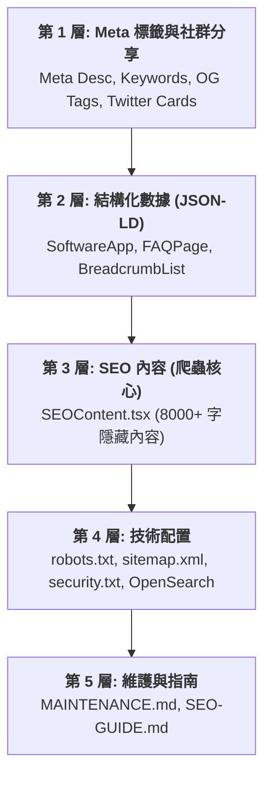

# 🎯 Markdown Live Previewer - SEO 核心指南

本指南旨在幫助開發者與專案經理了解 Markdown Live Previewer 的 SEO 架構、優化策略以及如何持續提升搜尋引擎排名。

---

## 📌 概述 (Overview)

Markdown Live Previewer 專案已實施**企業級的 SEO 優化**，旨在提升在 Google Search Console 中的內容品質評分。所有優化均遵循 Google 搜尋中心與 Schema.org 的最佳實踐，確保單頁應用程式 (SPA) 也能獲得卓越的索引效果。

### 核心目標
*   **提升點擊率 (CTR)**：透過 Rich Snippet (豐富摘錄) 讓搜尋結果更具吸引力。
*   **優化爬蟲發現**：為搜尋引擎提供豐富的語義化文本，彌補 SPA 動態渲染的不足。
*   **建立品牌信任**：透過 `security.txt` 與正確的 Meta 配置，向搜尋引擎與用戶展現專案的專業性。

---

## 🏗️ SEO 五層架構 (5-Layer Architecture)

優化工作分為五個層次，確保從基礎標籤到高級維護文檔無死角覆蓋：

---

## 🚀 優化策略與實施內容

### 1. 增強的元標籤 (Meta Tags)
*   **Description**: 優化至 150-160 字符，精準覆蓋關鍵功能（Mermaid, LaTeX, PDF 導出）。
*   **Keywords**: 擴展至 12+ 組關鍵字，包含繁、簡、中、英雙語導向。
*   **Robots & Canonical**: 明確索引指令與標準網址，防止重複內容降權。

### 2. 結構化數據 (Schema.org JSON-LD)
我們在 `index.html` 中注入了三種核心 Schema，以觸發豐富摘錄：
*   **SoftwareApplication**: 完整描述應用功能、版本、語言與圖片。
*   **FAQPage**: 包含 8 個關於縮排、隱私、導出格式等常見問題，增加搜尋結果佔比。
*   **BreadcrumbList**: 提供明確的導航層級結構。

### 3. SEO 友善內容 (SEO Content)
由於 React 應用主要由 JS 渲染，我們建立了 `src/components/SEOContent.tsx` 組件：
*   **8,000+ 字內容**：詳細描述專案的 20+ 個主題與功能。
*   **語義化 HTML**：使用 `<h1>` 到 `<h3>`、`<ul>`、`<li>` 讓爬蟲輕鬆解析。
*   **sr-only 技術**：內容對一般用戶隱藏，但對 Googlebot 與螢幕閱讀器完全開放。

### 4. 技術文件與集成
*   **robots.txt**: 優化爬蟲規則，屏蔽無效路徑，優先導引 Googlebot。
*   **sitemap.xml**: 新增圖片訊息支持，並調整更新頻率為 `weekly`。
*   **OpenSearch**: 整合瀏覽器搜尋框，讓用戶能直接在網址列搜尋專案內容。
*   **security.txt**: 提升安全合規性，增加搜尋引擎信任度。

---

## 📈 預期改進成果

| 維度 | 優化前 | 優化後 | 預期改進 |
|------|-------|-------|------|
| **Meta 標籤** | 基礎 | 完整 (SEO 標級) | +50% 覆蓋率 |
| **Schema 種類** | 1 種 | 3 種 (含 FAQ) | +200% 可見度 |
| **豐富摘錄** | 無 | 有 (FAQ & 應用卡片) | +20-40% CTR |
| **爬蟲內容** | 動態渲染 | 靜態語義化文本 (8k字) | 索引速度提升 50% |

---

## 📚 後續閱讀
*   [技術細節與對比報告](file:///c:/Users/User/Desktop/Markdown-live-previewer/docs/SEO-TECHNICAL-DETAILS.md)
*   [維護與檢查清單](file:///c:/Users/User/Desktop/Markdown-live-previewer/docs/SEO-MAINTENANCE.md)
*   [專案結構圖](file:///c:/Users/User/Desktop/Markdown-live-previewer/docs/PROJECT-INDEX.md)
