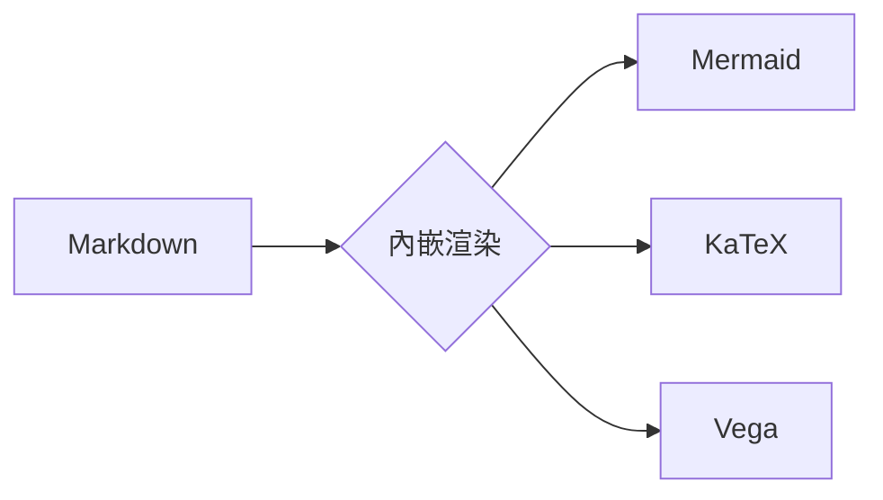
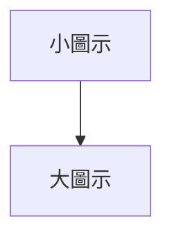

# Markdown 文法指南

歡迎使用 **Markdown 即時編輯器** ✨  
本指南將帶你快速了解常用 Markdown 語法，並示範本編輯器支援的進階功能。

---

## 標題（Headings）

# 這是標題 H1
## 這是標題 H2
### 這是標題 H3
#### 這是標題 H4
##### 這是標題 H5
###### 這是標題 H6

---

## 強調（Emphasis）

*此文字為斜體*  
_此文字也是斜體_

**此文字為粗體**  
__此文字也是粗體__

***粗斜體***  
~~刪除線~~

_你也可以 **混合使用** 不同樣式_

---

## 列表（Lists）

### 無序列表（Unordered）

* 項目 1
* 項目 2
  * 項目 2a
  * 項目 2b
* 項目 3
  * 項目 3a
  * 項目 3b

### 有序列表（Ordered）

1. 項目 1
2. 項目 2
3. 項目 3
  1. 項目 3a
  2. 項目 3b

---

## 列表進階示範（支援至 5 階）

### 有序列表樣式

1. 第一階 (1)
    1. 第二階 (A)
        1. 第三階 (a)
            1. 第四階 (I)
                1. 第五階 (i)
                    1. 第六階 (α)

### 無序列表樣式

* 第一階（實心圓）
    * 第二階（空心圓）
        * 第三階（實心方塊）
            * 第四階（空心方塊）
                * 第五階（實心三角）
                    * 第六階 (空心三角)

---

## 連結（Links）

您可能正在使用  
[Markdown 即時編輯器](https://markdown-live-previewer-a6dx.onrender.com/)

如果需要語法上的幫助可以參考
[標記掉落 語法大全](https://hackmd.io/@eMP9zQQ0Qt6I8Uqp2Vqy6w/SyiOheL5N/%2FBVqowKshRH246Q7UDyodFA)

---

## 圖片（Images）


---

## 引用區塊（Blockquote）

> Markdown 是一種輕量級的標記語言，  
> 採用純文字語法，於 2004 年由 John Gruber 與 Aaron Swartz 創建。
>
> 常用於 README、技術文件、論壇文章與筆記整理。

---

## 程式碼（Code）

### 行內程式碼

本網站使用 `markedjs/marked` 進行解析。
例如：`console.log('Hello')`

### 程式碼區塊

```javascript
function sayHello() {
  console.log('Hello, Markdown Live Editor!');
}
```

---

## 🚀 進階擴展功能

本編輯器支援多種進階渲染引擎，讓您的 Markdown 文檔更具表現力。

### 1. Mermaid 圖表(內嵌式)

可以直接在 Markdown 中撰寫 Mermaid 語法：



### 2. 數學公式(MathJax)

本編輯器使用 **MathJax 3** 進行渲染，支援高階互動與自定義巨集。

#### 基礎語法
- **行內公式**：$E = mc^2$
- **區塊公式**：

$$
I = \int_{0}^{\infty} e^{-x^2} dx = \frac{\sqrt{\pi}}{2}
$$

#### 互動功能(New! ✨)

本編輯器支援 MathJax 的完整互動功能：

- **複製公式**：在公式上**點擊右鍵** > **Show Math As**，可選擇不同格式：
  - **TeX Commands**：原始 LaTeX 代碼（如 `E = mc^2`）
    - 💡 **適用於**：貼回本編輯器、其他支援 LaTeX 的編輯器（如 Overleaf、Notion）
    - 📋 範例：複製後得到 `\frac{1}{2}`，可直接用於 `$...$` 或 `$$...$$` 中
  
  - **MathML Code**：網頁標準的數學標記語言
    - 💡 **適用於**：貼到網頁 HTML、支援 MathML 的應用程式
    - 📋 範例：複製後得到 `<math><mfrac>...</mfrac></math>`
  
  - **Annotation**：包含原始 LaTeX 的完整 MathML（同時保留兩種格式）

- **縮放瀏覽**：點擊公式可放大檢視細節，方便閱讀複雜的數學表達式

#### 自定義巨集(Macros)

本編輯器預設支援多種常用數學巨集，讓您更快速地輸入數學公式：

##### **數學集合**
- `\RR` → $\RR$ （實數集）
- `\NN` → $\NN$ （自然數集）
- `\ZZ` → $\ZZ$ （整數集）
- `\QQ` → $\QQ$ （有理數集）
- `\CC` → $\CC$ （複數集）

範例：$f: \RR \to \CC$ 表示從實數到複數的函數

##### **微分與積分**
- `\dd` → $\dd$ （微分符號）
- `\dv{f}{x}` → $\dv{f}{x}$ （導數）
- `\pdv{f}{x}` → $\pdv{f}{x}$ （偏導數）

範例：$\dv{}{x}(x^2) = 2x$ 或 $\int x \dd x = \frac{x^2}{2} + C$

##### **自動調整括號**
- `\norm{x}` → $\norm{x}$ （範數）
- `\abs{x}` → $\abs{x}$ （絕對值）
- `\set{x}` → $\set{x}$ （集合表示）
- `\paren{x}` → $\paren{x}$ （圓括號）
- `\bracket{x}` → $\bracket{x}$ （方括號）
- `\angle{x, y}` → $\angle{x, y}$ （內積/角括號）

範例：$\norm{\vect{v}} = \sqrt{\angle{\vect{v}, \vect{v}}}$

##### **向量與矩陣**
- `\vect{v}` → $\vect{v}$ （向量）
- `\mat{A}` → $\mat{A}$ （矩陣）
- `\bold{text}` → $\bold{text}$ （粗體）

##### **完整範例**

以下是一個使用多個巨集的完整數學表達式：

$$
\text{令 } f: \RR^n \to \RR, \text{ 則梯度定義為：}
$$

$$
\nabla f = \paren{\pdv{f}{x_1}, \pdv{f}{x_2}, \ldots, \pdv{f}{x_n}}
$$

$$
\text{且範數滿足：} \norm{\vect{a} + \vect{b}} \leq \norm{\vect{a}} + \norm{\vect{b}}
$$

您也可以在**設定**中自訂更多巨集！


### 3. 數據視覺化(Vega-Lite)

支援以 JSON 語法定義專業圖表：

```vega-lite
{
  "$schema": "https://vega.github.io/schema/vega-lite/v5.json",
  "description": "簡單的長條圖",
  "data": {
    "values": [
      { "a": "A", "b": 28 }, { "a": "B", "b": 55 }, { "a": "C", "b": 43 },
      { "a": "D", "b": 91 }, { "a": "E", "b": 81 }, { "a": "F", "b": 53 }
    ]
  },
  "mark": "bar",
  "encoding": {
    "x": { "field": "a", "type": "nominal", "axis": { "labelAngle": 0 } },
    "y": { "field": "b", "type": "quantitative" }
  }
}
```

---

## 🧠 智慧縮排（編輯輔助功能）

本編輯器支援**智慧縮排**，可大幅提升列表與程式碼編輯效率。

### 使用方式

1. 將游標放在任一行，或選取多行
2. 按下 `Tab` → 增加一層縮排
3. 按下 `Shift + Tab` → 取消一層縮排

> 💡 小技巧
> - 可同時選取多行進行縮排
> - 特別適合巢狀列表與程式碼區塊編輯

---

## 🛠️ 編輯器進階功能

### 1. 圖表尺寸控制
您可以在 Mermaid 程式碼區塊的最上方加入特殊指令來調整顯示大小（此設定也會套用到 PDF 匯出）：



### 2. 智能錯誤容錯
當您編輯圖表時若發生語法錯誤，**編輯器會保留上一次成功渲染的圖表**，並在頂部顯示輕量級錯誤提示。您不用擔心誤刪一個字元就導致整個圖表消失！

### 3. PDF 匯出優化
本編輯器針對列印與 PDF 匯出做了特別優化：
- **Vega 圖表自動縮放**：避免圖表過大被裁切（預設縮放 90%）。
- **精準邊界**：強制設定 10mm 邊界，確保文件整齊。

---

### 4. 化學反應方程式 (mhchem)

本編輯器透過 **MathJax mhchem 擴充**支援標準化學式語法，使用 `\ce{...}` 書寫。

#### 行內語法

水分子：$\ce{H2O}$，硫酸：$\ce{H2SO4}$，葡萄糖：$\ce{C6H12O6}$

#### 化學反應方程式（區塊）

$$\ce{H2SO4 + 2NaOH -> Na2SO4 + 2H2O}$$

$$\ce{CH4 + 2O2 -> CO2 + 2H2O}$$

#### 離子方程式與特殊符號

$$\ce{Fe^{2+}_{(aq)} + 2OH^-_{(aq)} -> Fe(OH)2 v}$$

$$\ce{CaCO3(s) + 2H+_{(aq)} -> Ca^{2+}_{(aq)} + H2O(l) + CO2 ^}$$

#### 平衡方程式

$$\ce{N2(g) + 3H2(g) <=> 2NH3(g)}$$

---

### 5. 分子骨架圖 (SMILES)

使用 ` ```smiles ` 程式碼區塊，以 **SMILES 字串**渲染 2D 分子骨架圖。

#### 苯（benzene）

```smiles
C1=CC=CC=C1
```

#### 乙醇（ethanol）

```smiles
CCO
```

#### 咖啡因（caffeine）

```smiles
Cn1cnc2c1c(=O)n(c(=O)n2C)C
```

#### 阿斯匹靈（aspirin）

```smiles
CC(=O)Oc1ccccc1C(=O)O
```

