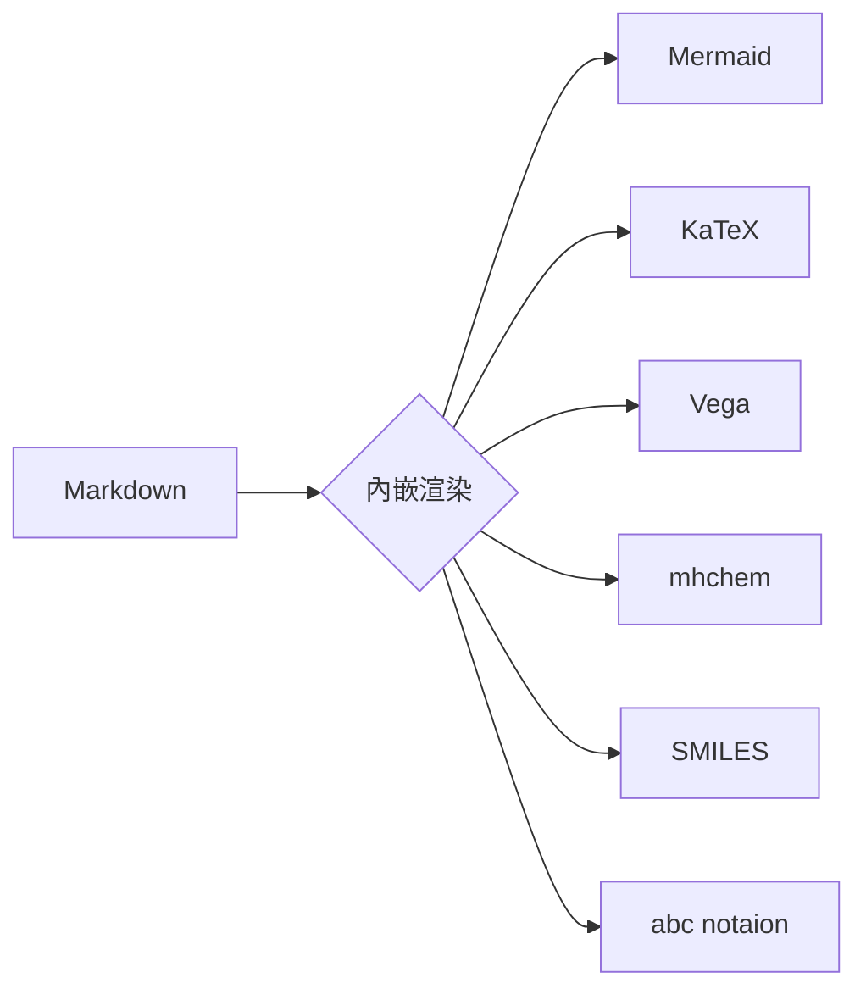

# Markdown 語法參考指南

歡迎使用 **Markdown 即時編輯器** ✨  
這是一個純文字標記語言的即時預覽工具。以下是本編輯器支援的所有語法參考。

---

## 標題（Headings）

# 這是標題 H1
## 這是標題 H2
### 這是標題 H3
#### 這是標題 H4
##### 這是標題 H5
###### 這是標題 H6

---

## 強調（Emphasis）

*此文字為斜體*  
_此文字也是斜體_

**此文字為粗體**  
__此文字也是粗體__

***粗斜體***  
~~刪除線~~

_你也可以 **混合使用** 不同樣式_

---

## 列表（Lists）

### 無序列表（Unordered）

* 項目 1
* 項目 2
  * 項目 2a
  * 項目 2b
* 項目 3
  * 項目 3a
  * 項目 3b

### 有序列表（Ordered）

1. 項目 1
2. 項目 2
3. 項目 3
  1. 項目 3a
  2. 項目 3b

---

## 列表進階示範（支援至 6 階）

### 有序列表樣式

1. 第一階 (1)
    1. 第二階 (A)
        1. 第三階 (a)
            1. 第四階 (I)
                1. 第五階 (i)
                    1. 第六階 (α)

### 無序列表樣式

* 第一階（實心圓）
    * 第二階（空心圓）
        * 第三階（實心方塊）
            * 第四階（空心方塊）
                * 第五階（實心三角）
                    * 第六階 (空心三角)

---

## 連結（Links）

您可能正在使用  
[Markdown 即時編輯器](https://markdown-live-previewer-a6dx.onrender.com/)

如果需要語法上的幫助可以參考
[標記掉落 語法大全](https://hackmd.io/@eMP9zQQ0Qt6I8Uqp2Vqy6w/SyiOheL5N/%2FBVqowKshRH246Q7UDyodFA)

---

## 圖片（Images）


---

## 引用區塊（Blockquote）

> Markdown 是一種輕量級的標記語言，  
> 採用純文字語法，於 2004 年由 John Gruber 與 Aaron Swartz 創建。
>
> 常用於 README、技術文件、論壇文章與筆記整理。

---

## 程式碼（Code）

### 行內程式碼

本網站使用 `markedjs/marked` 進行解析。
例如：`console.log('Hello')`

### 程式碼區塊

```javascript
function sayHello() {
  console.log('Hello, Markdown Live Editor!');
}
```

---

## 🚀 進階擴展功能

本編輯器支援多種進階渲染引擎，讓您的 Markdown 文檔更具表現力。

### 1. Mermaid 圖表(內嵌式)

可以直接在 Markdown 中撰寫 Mermaid 語法：



### 2. MathJax 數學公式
支援 LaTeX 語法。

- **行內公式**：$E = mc^2$
- **區塊公式**：
$$
I = \int_{0}^{\infty} e^{-x^2} dx = \frac{\sqrt{\pi}}{2}
$$

### 3. mhchem 化學式
使用 `\ce{...}` 語法。

- 硫酸：$\ce{H2SO4}$
- 反應式：$\ce{CH4 + 2O2 -> CO2 + 2H2O}$

### 4. Vega-Lite 數據視覺化
使用 JSON 定義圖表。

```vega-lite
{
  "$schema": "https://vega.github.io/schema/vega-lite/v5.json",
  "data": { "values": [{ "a": "A", "b": 28 }, { "a": "B", "b": 55 }, { "a": "C", "b": 43 }] },
  "mark": "bar",
  "encoding": {
    "x": { "field": "a", "type": "nominal" },
    "y": { "field": "b", "type": "quantitative" }
  }
}
```

### 5. SMILES 分子結構
```smiles
Cn1cnc2c1c(=O)n(c(=O)n2C)C
```

### 6. ABC 樂譜渲染
```abc
X:1
T:Simple Scale
M:4/4
L:1/4
K:C
C D E F | G A B c |
```
