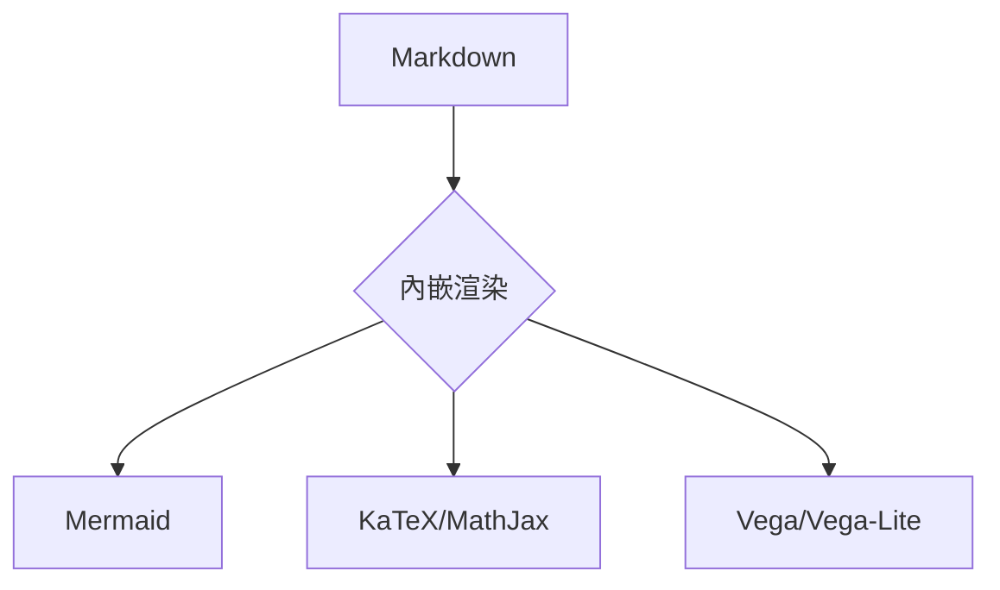
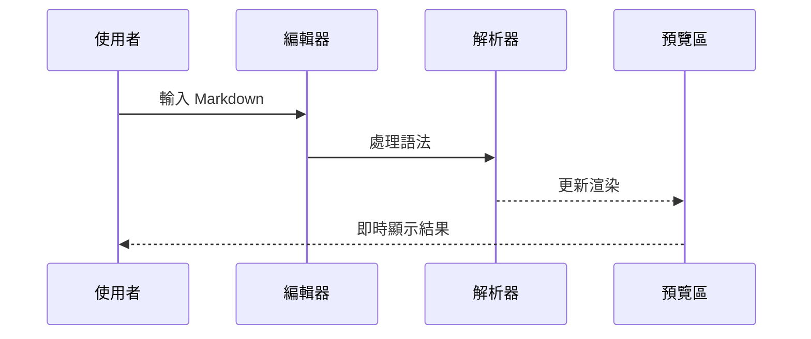
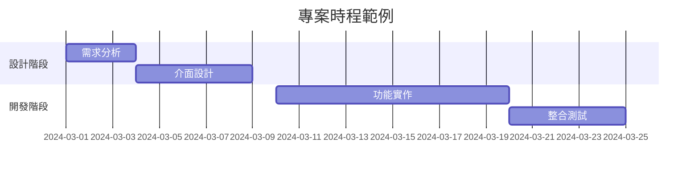

# 內嵌圖表範本 (Mermaid)
在此模式下，您可以在 Markdown 文檔中通過程式碼區塊撰寫流程圖、時序圖等。

## 1. 流程圖 (Flowchart)

```mermaid
graph TD
    A[Markdown] --> B{內嵌渲染}
    B --> C[Mermaid]
    B --> D[KaTeX/MathJax]
    B --> E[Vega/Vega-Lite]
```

## 2. 時序圖 (Sequence Diagram)

```mermaid
sequenceDiagram
    使用者->>編輯器: 輸入 Markdown
    編輯器->>解析器: 處理語法
    解析器-->>預覽區: 更新渲染
    預覽區-->>使用者: 即時顯示結果
```

## 3. 甘特圖 (Gantt Chart)

```mermaid
gantt
    title 專案時程範例
    dateFormat  YYYY-MM-DD
    section 設計階段
    需求分析           :a1, 2024-03-01, 3d
    介面設計           :after a1  , 5d
    section 開發階段
    功能實作           :2024-03-10  , 10d
    整合測試           : 5d
```
